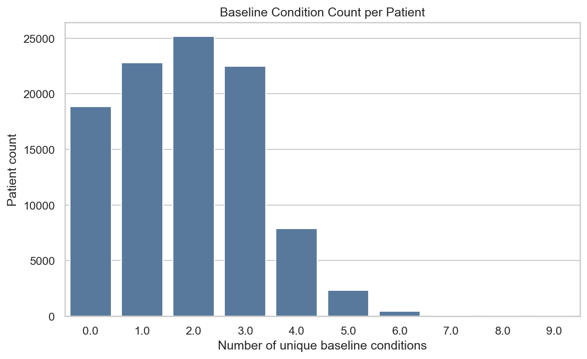
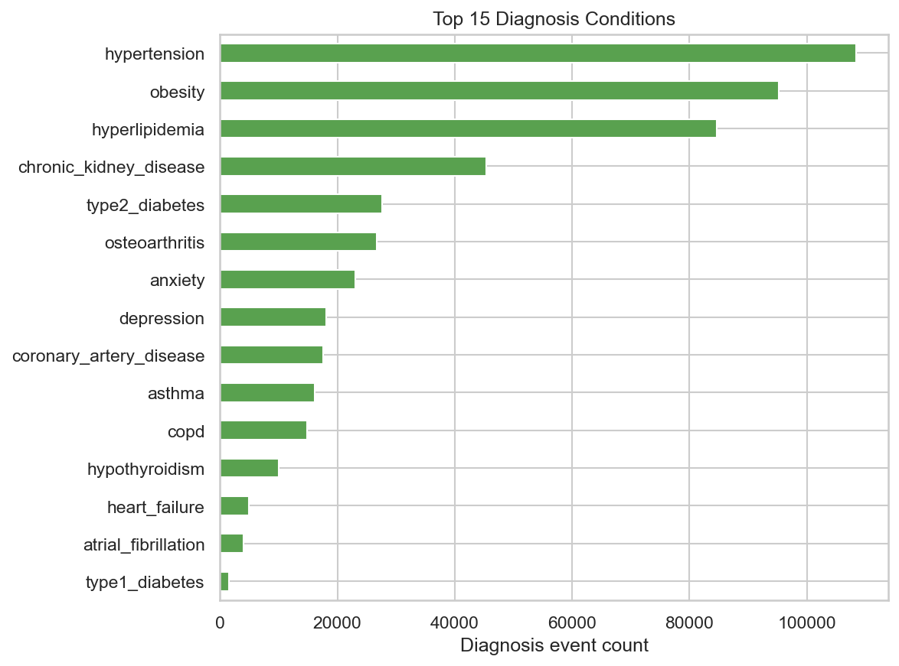
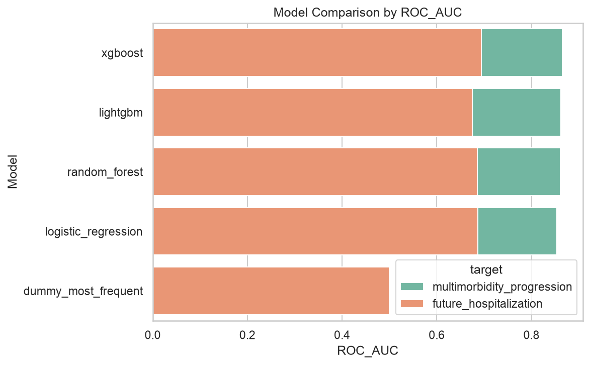
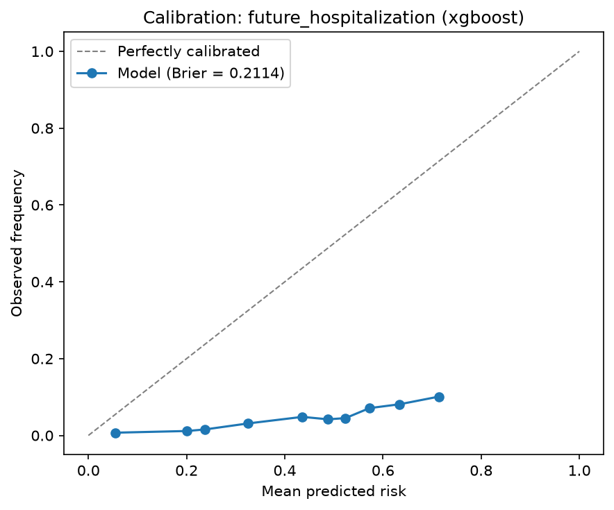
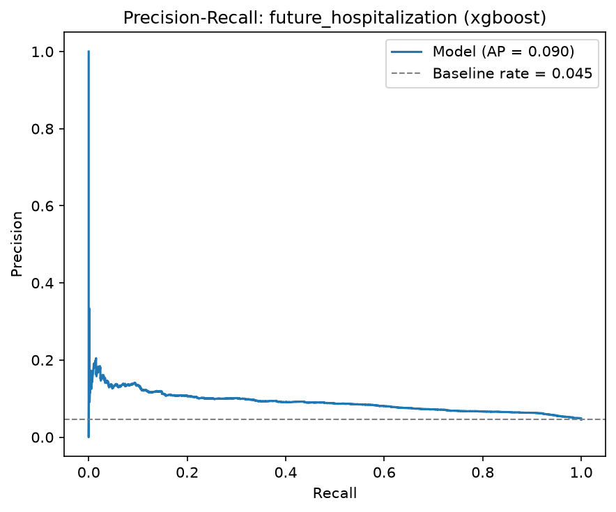
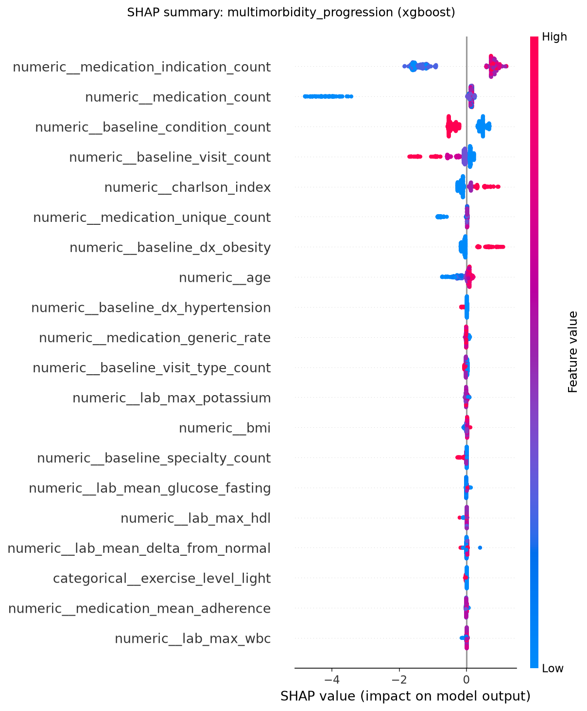
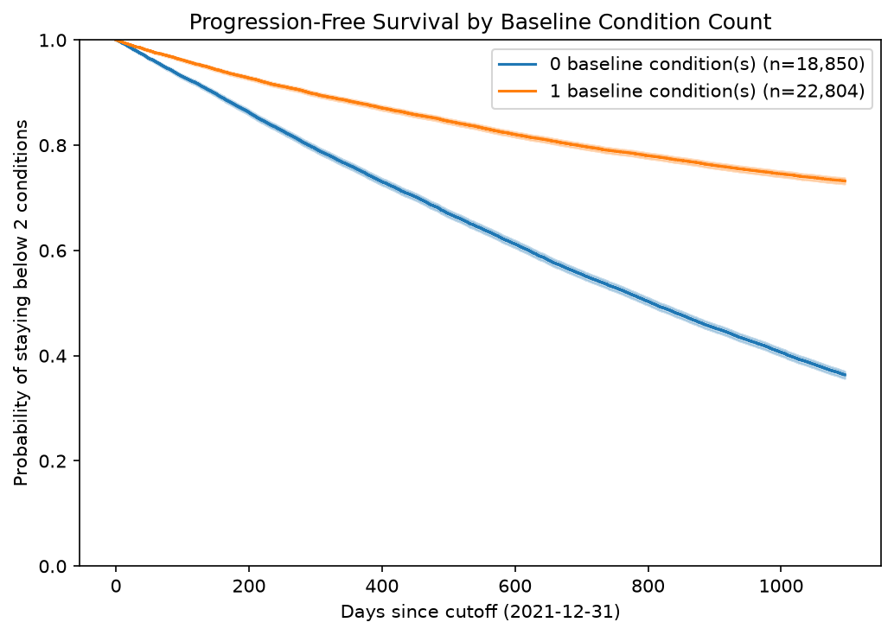

# Disease Progression and Multimorbidity Trajectory Prediction

**Final Project Report**

## Executive Summary

This project developed a reproducible machine learning workflow for predicting
disease progression and multimorbidity risk using synthetic electronic health
record (EHR) data from 2018 to 2024. Predictors use records through 2021-12-31;
future outcomes cover 2022-01-01 through 2024-12-31.

The final feature table contains **100,000 patients and 99 columns**. Across five
model families (a majority-class baseline, logistic regression, random forest,
XGBoost, and LightGBM), gradient boosting performed best on both targets:

- **Future hospitalization**: XGBoost, ROC-AUC **0.694** (logistic regression a
  close baseline at 0.686). This target is highly imbalanced (4.55% positive).
- **Multimorbidity progression**: XGBoost, ROC-AUC **0.865**, F1 **0.774**, on the
  at-risk cohort of 41,654 patients who begin with fewer than two conditions.

Beyond ranking models, the project adds calibration and threshold analysis, SHAP
explainability, and a Kaplan-Meier / Cox survival analysis of time to
multimorbidity progression.

## 1. Introduction and Motivation

Healthcare teams need earlier signals of patients who may progress into
multimorbidity or require future hospital care, so that limited follow-up
capacity can be directed where it matters most. This project asks whether
patient demographics, baseline diagnoses, laboratory history, medication history,
and prior hospitalization patterns — all known at a fixed cutoff — can predict:

- future hospitalization risk (2022–2024),
- future ICU admission risk,
- future 30-day readmission risk, and
- progression into multimorbidity among patients with fewer than two baseline
  conditions.

## 2. Related Work

Multimorbidity risk stratification and hospital utilization prediction are
established areas in clinical machine learning. Comorbidity indices such as the
Charlson index summarize disease burden, and gradient-boosted trees and
regularized logistic regression are common, strong baselines for tabular EHR
prediction. Time-to-event methods (Kaplan-Meier estimation and Cox proportional
hazards regression) are the standard tools for modeling *when* an event occurs
rather than only whether it occurs. This project follows these conventions on a
synthetic dataset that mimics the structure of real EHR extracts.

## 3. Data Description and Exploratory Analysis

The synthetic dataset comprises five linked tables — patients, diagnoses,
laboratory results, medications, and hospital outcomes — keyed by `patient_id`.
Exploratory analysis characterized the baseline condition burden (mean 1.87
distinct conditions per patient), the most common conditions and their
co-occurrence, and condition trajectories over time.





Observed outcome rates in the modeling dataset:

| Outcome | Rate |
|---|---|
| Future hospitalization | 4.55% |
| Future ICU admission | 0.10% |
| Future 30-day readmission | 0.68% |
| Multimorbidity progression | 18.11% |

## 4. Data Pre-processing and Feature Engineering

Raw tables were cleaned with type coercion, date parsing, and clinical range
checks (e.g. implausible ages or blood pressures set to missing rather than
modeled). Diagnosis records were exploded into a tidy condition-event table
combining primary and secondary diagnoses.

Features are engineered **per patient using only events on or before the
2021-12-31 cutoff**: baseline condition counts and one-hot condition flags, visit
and specialty counts, laboratory summaries (counts, abnormal rates, and per-test
mean/max values), medication summaries (counts, adherence, duration, indications),
and prior hospitalization statistics.

### Leakage-aware design

- Predictors are derived strictly from pre-cutoff dated events.
- The patient-level all-time `dx_*` columns are dropped, because they may encode
  diagnoses made after the cutoff.
- All target columns are excluded from the model matrix by
  `get_modeling_matrices`, which is enforced by automated tests.

## 5. Technical Approach

Two prediction targets are modeled:

- **Future hospitalization** is predicted for all 100,000 patients.
- **Multimorbidity progression** is predicted only within the *at-risk cohort* of
  41,654 patients who start with fewer than two baseline conditions, since
  progression is undefined for patients who are already multimorbid.

For each target we train a majority-class baseline (`DummyClassifier`), logistic
regression, random forest, XGBoost, and LightGBM inside scikit-learn pipelines
that impute, scale, and one-hot encode features. Class imbalance is handled with
balanced class weights (and `scale_pos_weight` for XGBoost). A stratified 75/25
train/test split is used throughout with a fixed random seed.

## 6. Test, Validation, and Evaluation Metrics

Because both targets are imbalanced, accuracy alone is misleading. Models are
evaluated with ROC-AUC, average precision, precision, recall, and F1 on the
held-out test split. A majority-class baseline is always included so that lift
over the trivial predictor is explicit.

## 7. Modeling Results and Findings

### Future hospitalization (all patients)

| Model | ROC-AUC | Avg precision | Precision | Recall | F1 |
|---|---|---|---|---|---|
| XGBoost | **0.694** | 0.090 | 0.073 | 0.677 | 0.132 |
| Logistic regression | 0.686 | 0.087 | 0.077 | 0.617 | 0.137 |
| Random forest | 0.685 | 0.086 | 0.127 | 0.024 | 0.040 |
| LightGBM | 0.675 | 0.084 | 0.078 | 0.453 | 0.134 |
| Dummy (majority) | 0.500 | 0.045 | 0.000 | 0.000 | 0.000 |

### Multimorbidity progression (at-risk cohort)

| Model | ROC-AUC | Avg precision | Precision | Recall | F1 |
|---|---|---|---|---|---|
| XGBoost | **0.865** | 0.777 | 0.697 | 0.869 | 0.774 |
| LightGBM | 0.862 | 0.770 | 0.691 | 0.865 | 0.768 |
| Random forest | 0.861 | 0.760 | 0.701 | 0.852 | 0.769 |
| Logistic regression | 0.853 | 0.764 | 0.696 | 0.831 | 0.757 |
| Dummy (majority) | 0.500 | 0.435 | 0.000 | 0.000 | 0.000 |



Multimorbidity progression is highly predictable from baseline history, while
future hospitalization is a much harder, rarer signal where all models offer
modest but real lift over the baseline.

## 8. Calibration and Threshold Analysis

Because care teams act on a risk threshold rather than a model ranking, the best
hospitalization model (XGBoost) was analyzed for calibration and threshold
trade-offs.





The model **ranks** patients well (ROC-AUC 0.694) but is **poorly calibrated**
(Brier score 0.211): class weighting inflates predicted probabilities, so the raw
scores should be treated as a ranking rather than as literal risks. The threshold
table (`outputs/tables/threshold_analysis.csv`) shows the trade-off — for example,
a 0.5 threshold flags 42% of patients at 68% recall and 7% precision. Recalibrating
(e.g. with `CalibratedClassifierCV`) is recommended before using absolute
thresholds clinically.

## 9. Explainability

SHAP `TreeExplainer` was applied to the best tree model for each target.



- **Future hospitalization**: prior hospitalization count, age, and Charlson
  index dominate — classic utilization and comorbidity drivers.
- **Multimorbidity progression**: medication indication count and total
  medication count (polypharmacy proxies), baseline condition count, and visit
  count are the strongest contributors.

Plain feature importance is retained as an environment-independent fallback.

## 10. Survival Analysis

Time to multimorbidity progression was analyzed for the at-risk cohort, with the
event being the day a patient reaches two distinct conditions and censoring at the
horizon. The survival event counts match the classification target exactly
(18,107 events), confirming a consistent definition.



A Cox proportional hazards model (`outputs/tables/cox_model_summary.csv`) shows
older age (hazard ratio ~1.02 per year) and higher Charlson index (HR ~1.49)
increase the progression hazard, as expected. Counterintuitively, patients
starting with one condition progress *slower* than those starting with none
(HR ~0.37); this is a property of the synthetic data — zero-condition patients
accumulate two new conditions more readily than one-condition patients add their
second — and is noted here as a data characteristic rather than a modeling error.

## 11. Limitations and Validity

- The data is synthetic; results do not transfer to real patients.
- Future hospitalization, ICU, and readmission are rare events; metrics for the
  rarest targets are unstable and were not fully modeled.
- The best hospitalization model is miscalibrated and needs recalibration before
  its probabilities are used as absolute risks.
- Some findings (e.g. the baseline-condition-count hazard) reflect quirks of the
  synthetic generator.

## 12. Future Work

- Recalibrate risk probabilities and tune operating thresholds per care setting.
- Model the rarer ICU and readmission targets with resampling or specialized
  loss functions.
- Extend survival analysis to time-to-first-hospitalization and competing risks.
- Validate the workflow on an independent synthetic or de-identified EHR dataset.

## 13. Reproducibility

The project ships reusable helpers in `src/`, ten ordered notebooks, and a
lightweight pipeline runner:

```bash
python run_pipeline.py --step features    # build the modeling dataset
python run_pipeline.py --step models      # train baseline + advanced models
python run_pipeline.py --step evaluate    # metrics + comparison figures
python run_pipeline.py --step calibrate   # threshold + calibration analysis
python run_pipeline.py --step explain     # SHAP summary + top-features table
python run_pipeline.py --step survival    # Kaplan-Meier + Cox model
python run_pipeline.py --step all         # run every step in order
```

Leakage-prevention and output-existence tests run with `pytest tests/`. A
Streamlit dashboard (`streamlit run app/streamlit_app.py`) summarizes the
dataset, metrics, figures, reports, and a single-patient risk lookup. See
`HANDOFF.md` for full setup, current metrics, and known limitations.
